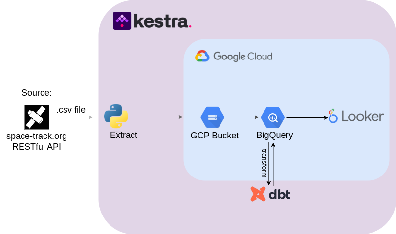

# Satellite Data Pipeline

## About
The `space-track.org` API provides detailed information about in-orbit objects, launch events (when known), and other satellite-related data. However, the dataset contains 40 columns, making it difficult to analyze relationships between different attributes.

Understanding how satellite features interact is crucial for uncovering insights about launches and orbital patterns. Given the dataset’s complexity, manually extracting insights is challenging. To address this, I developed a data engineering pipeline that automates data extraction, loads it into the Google Cloud Platform (GCP) environment, and transforms it using dbt to enable visualization and analysis in Looker Studio.

## The problem
Understanding how different features of the dataset interact with each other and deriving meaningful insights about satellite launches and in-orbit objects is challenging due to the dataset's complexity and volume. The data, sourced from a RESTful API, is updated frequently, making it difficult to track changes, identify patterns, and extract actionable insights in a structured way. To address this, I designed a pipeline that automates data extraction, loading, and transformation. By processing the dataset daily and structuring it into optimized tables using dbt, the pipeline enables efficient visualization and analysis, helping to uncover trends, correlations, and key insights from continuously updated satellite data.

## The pipeline

 –

The pipeline follows an `ELT (Extract, Load, Transform)` approach and is `fully orchestrated within Kestra`, enabling `automated batch processing through backfill executions and daily scheduled runs`. It begins with a Python script that extracts data from the `space-track.org RESTful API`, specifically the General Perturbations (GP) dataset, which includes both known and unidentified objects detected via Radar Cross Section (RCS). The extracted data is saved as a .csv file within Kestra internal variables and `uploaded` to a Google Cloud Platform (GCP) `Bucket`. 

From there, it is `loaded into BigQuery as an external table`, allowing direct querying without immediate transformation. Each day, the newly extracted dataset is compared against the previous day's table instead of the main table, optimizing the update process by avoiding unnecessary iterations over the full dataset. If changes are detected, new rows are inserted, and existing records are updated in the main table. If no changes are found, the newly created daily table is dropped and deleted, ensuring efficient storage management. Once the main table is updated, `dbt executes the transformation` step, generating new tables optimized for analytics. These tables aggregate key attributes, filter unnecessary columns, and restructure the data to enhance usability in Looker Studio for visualization and insight generation. By leveraging Kestra as the workflow orchestrator, this ELT pipeline automates the entire data lifecycle, ensuring efficient, scalable, and continuously updated processing of satellite data.

# User requirements
> [!NOTE]
> The commands used to run the project must be inside a Linux environment, because this project was developed using mainly [WSL](https://learn.microsoft.com/en-us/windows/wsl/) and [Docker Desktop](https://www.docker.com/products/docker-desktop/) on `Windows`,  so if you are using Windows please click on the links of each of them and follow the download guide, i've used Ubuntu as well for the development. This guide will account for Ubuntu, Debian and WSL. I will provide links for the docs if you use another distribution or MacOS.

Apart of that, the user will need a [space-track.org](https://www.space-track.org/auth/login) account to interact with the RESTful API within Kestra and a [GCP](https://cloud.google.com/) (Google Cloud Plataform) account, to store the `.csv` inside a `Bucket` and create tables inside `Big Query`.

## Set-up
First of all, you need to download [docker compose](https://docs.docker.com/compose/install/linux/) in your Linux or WSL, as following:
```Bash
sudo apt-get update
sudo apt-get install docker-compose-plugin
```

Now, we need to run the `docker-compose.yml` file to start `Kestra`:

```Bash
docker compose up -d
```

If account with privilege is needed, run:

```Bash
sudo docker compose up -d
```

After that, we need to upload this project Kestra flows inside Kestra:

```Bash
curl -X POST http://localhost:8080/api/v1/flows/import -F fileUpload=@flows/full_pipeline.yml
curl -X POST http://localhost:8080/api/v1/flows/import -F fileUpload=@flows/set_kvs.yml
curl -X POST http://localhost:8080/api/v1/flows/import -F fileUpload=@flows/setup_gcp.yml
```

Now, with docker compose running, go ahead on your browser and search `localhost:8080` to interact with Kestra interface. Click on `Flows`


