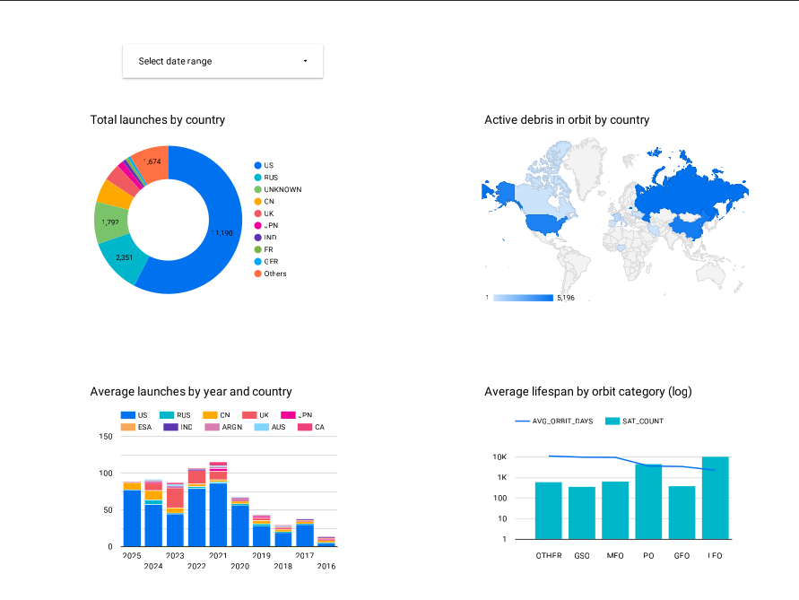
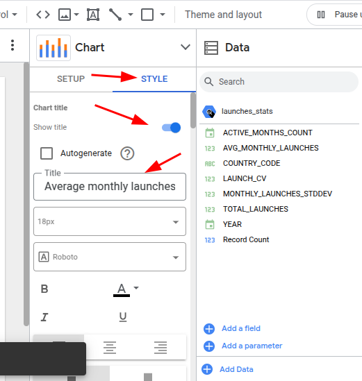
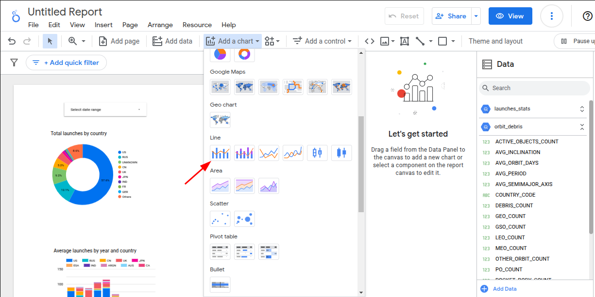

# Satellite Data Pipeline

## About
The `space-track.org` API provides detailed information about in-orbit objects, launch events (when known), and other satellite-related data. However, the dataset contains 40 columns, making it difficult to analyze relationships between different attributes.

Understanding how satellite features interact is crucial for uncovering insights about launches and orbital patterns. Given the dataset’s complexity, manually extracting insights is challenging. To address this, I developed a data engineering pipeline that automates data extraction, loads it into the Google Cloud Platform (GCP) environment, and transforms it using dbt to enable visualization and analysis in Looker Studio.

## The problem
Understanding how different features of the dataset interact with each other and deriving meaningful insights about satellite launches and in-orbit objects is challenging due to the dataset's complexity and volume. The data, sourced from a RESTful API, is updated frequently, making it difficult to track changes, identify patterns, and extract actionable insights in a structured way. To address this, I designed a pipeline that automates data extraction, loading, and transformation. By processing the dataset daily and structuring it into optimized tables using dbt, the pipeline enables efficient visualization and analysis, helping to uncover trends, correlations, and key insights from continuously updated satellite data.

## The pipeline

 –

The pipeline follows an `ELT (Extract, Load, Transform)` approach and is `fully orchestrated within Kestra`, enabling `automated batch processing through backfill executions and daily scheduled runs`. It begins with a Python script that extracts data from the `space-track.org RESTful API`, specifically the General Perturbations (GP) dataset, which includes both known and unidentified objects detected via Radar Cross Section (RCS). The extracted data is saved as a .csv file within Kestra internal variables and `uploaded` to a Google Cloud Platform (GCP) `Bucket`. 

From there, it is `loaded into BigQuery as an external table`, allowing direct querying without immediate transformation. Each day, the newly extracted dataset is compared against the previous day's table instead of the main table, optimizing the update process by avoiding unnecessary iterations over the full dataset. If changes are detected, new rows are inserted, and existing records are updated in the main table. If no changes are found, the newly created daily table is dropped and deleted, ensuring efficient storage management. Once the main table is updated, `dbt executes the transformation` step, generating new tables optimized for analytics. These tables aggregate key attributes, filter unnecessary columns, and restructure the data to enhance usability in Looker Studio for visualization and insight generation. By leveraging Kestra as the workflow orchestrator, this ELT pipeline automates the entire data lifecycle, ensuring efficient, scalable, and continuously updated processing of satellite data.

## How to run
### User requirements
> [!NOTE]
> The commands used to run the project must be inside a Linux environment, because this project was developed using mainly [WSL](https://learn.microsoft.com/en-us/windows/wsl/) and [Docker Desktop](https://www.docker.com/products/docker-desktop/) on `Windows`,  so if you are using Windows please click on the links of each of them and follow the download guide, i've used Ubuntu as well for the development. This guide will account for Ubuntu, Debian and WSL. I will provide links for the docs if you use another distribution.

Apart of that, the user will need a [space-track.org](https://www.space-track.org/auth/login) account to interact with the RESTful API within Kestra and a [GCP](https://cloud.google.com/) (Google Cloud Plataform) account, to store the `.csv` inside a `Bucket` and create tables inside `Big Query`.

### Set-up
First of all, you need to download [docker compose](https://docs.docker.com/compose/install/linux/) in your Linux or WSL, as following:
```Bash
sudo apt-get update
sudo apt-get install docker-compose-plugin
```

### Setting up a GCP Service Account

### Running Kestra
Now, we need to run the `docker-compose.yml` file to start `Kestra`:

```Bash
docker compose up -d
```

If account with privilege is needed, run:

```Bash
sudo docker compose up -d
```

After that, we need to upload this project Kestra flows inside Kestra:

```Bash
curl -X POST http://localhost:8080/api/v1/flows/import -F fileUpload=@flows/full_pipeline.yml
curl -X POST http://localhost:8080/api/v1/flows/import -F fileUpload=@flows/set_kvs.yml
curl -X POST http://localhost:8080/api/v1/flows/import -F fileUpload=@flows/setup_gcp.yml
```

Now, with docker compose running, go ahead on your browser and search `localhost:8080` to interact with Kestra interface. Click on `Flows`, your tab will look like the following image, the red boxes are the flows that we uploaded to Kestra API using curl:

 

First, we start heading to `set_kvs` flow, there you will change the red boxes in the image bellow with the values requested, then click on `Execute` in the top right:

 

After that, click on `Flows` again and head to `setup_gcp` and `click on Execute`.

Now, for last, go back to `Flows` and click on `full_pipeline` and then `Trigger` and `Backfill executions` as the image bellow: 
 

In the pop-up you will see a `start date` and a `end date`, in the `start date` select today's date, for example 30/03/2025, and for the `end date` click on `now`, check if dates are correct and press `execute backfill`, see image bellow:

 

After this flow finishes it execution, your BigQuery will have a bunch of tables inside two main nodes (dbt_satellite_analytics, from dbt, and project_zoomcamp, main table), inside dbt_satellite_analytics there are three tables ready for analysis using Looker Studio.

### Creating dashboards using Looker Studio
For this step by step tutorial we are going to create the following dashboard:


Now that we have our data ready to analysis, we can create some cool plots using them. Go ahead to [Looker Studio](https://lookerstudio.google.com/) and `start a new blank report`, to create plots we need to connect a dataset with Looker Studio, our data is inside Big Query, so `click on the Big Query connector`:
  

Select your project, then `dbt_satellite_analytics` and select all tables, you can select one at a time, so after selecting the first one, click on add data and select the other ones.
 

After selecting all the tables we are ready to insert charts, let's start with a world map chart to view our `orbit_debris` table:
 
Because we selected all the data tables, you may see an error in your chart (`Chart configuration incomplete` or the wrong table selected), click on `Data Source` bellow the text Setup and select `orbit_debris` as a source:
 
Now you can just drag the tables columns inside the fields from the geo chart, we need them to be as the image bellow:
    

Let's add a title to the chart, so the viewers can identify what's happening there. Click on `Style`, then `Show title`, and write `Active debris in orbit by country`
  

Now, let's add a donut chart showing the countries with most launches from the `launches_stats`table. First, get a donut chart via `Add a chart` option:
  
If the data source is not `launches_stats`, change the current one with the desired one, as in the previous chart. Drag the columns to be the same as the image:
   

Great, let's set a title to it:
 

And we need to change the values from percentage(%) to actual numbers:


Because our new chart contains a `Date range dimension`, we can filter it by year, but Looker Studio doesn't know that the Year dimension is a year in fact, it is 01/01/year, for instance, so we need to configure it to a year. Hover `Resource` in the UI and then `click on manage added data sources`:
 

Click on `edit` in the `launches_stats` table, see that the `YEAR` column is a `Date`, not a `Year`, let's change it, click `Done` after changes:


Now, head back to your report and click on `Add a control` and select `Date range control`, put it above our donut chart:


Feel free to select time ranges to see how the chart reacts.

We are half way there, just 2 tiles remaining. Let's create a chart showing the average launches per year using the `launches_stats` table again, select the following chart:


Then:


Well, it is not sorted by year, let's fix that:

Make sure that the sorting by year is descending, not ascending. We need to add a title as well, which will be `Average launches by year and country`:


Now, our last tile, ihullll, this one will be about the average days on orbit by type of orbit, in other words, there are a lot of types of orbits, based on altitude, inclination, etc, with dbt, we made a classification of the main types of orbits, now we are going to use it to see if there is some kind of relation between orbit type and how long a payload stays in orbit, and if drag is associated as well. We are going to use the `lifespan_orbit` table for that.

Select a `combo chart`:


Now, drag the columns to be the same as the image bellow:


`The instruction bellow is optional.`

Would be nice to see how the average drag influences the lifespan of a satellite, but there is a problem, the average drag is a value smaller than 0, but the y-axis is values bigger than 1000, so in the way it is the average drag will not be visible as we want, to fix that we need to use a log scale, but the log scale will make each bar of the chart not as different as we want from each other, so it will be harder to se how different each one is. Because of that, adding the average drag is an `optional choice`.
First click on the slider `Optional metrics` and drag the `AVG_DRAG` to it:

Hover your chart to see the new optional metrics:

Press it and select `AVG_DRAG` as well.
For last, find the `left y-axis` section and update it with the following values:


Let's add a title:


And, voilà! Now we are done, our analytics is complete!!!


                                                              

 


